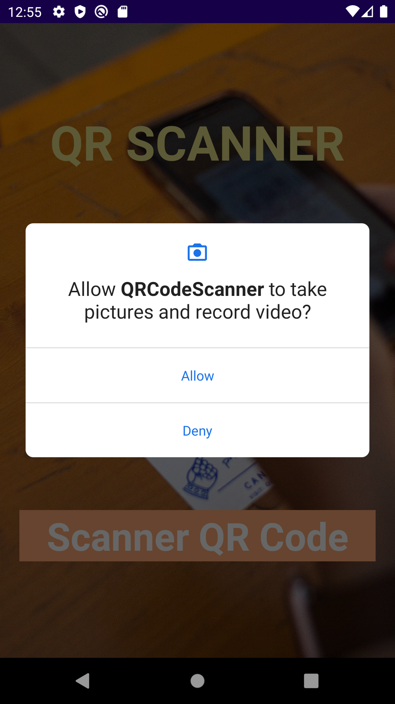
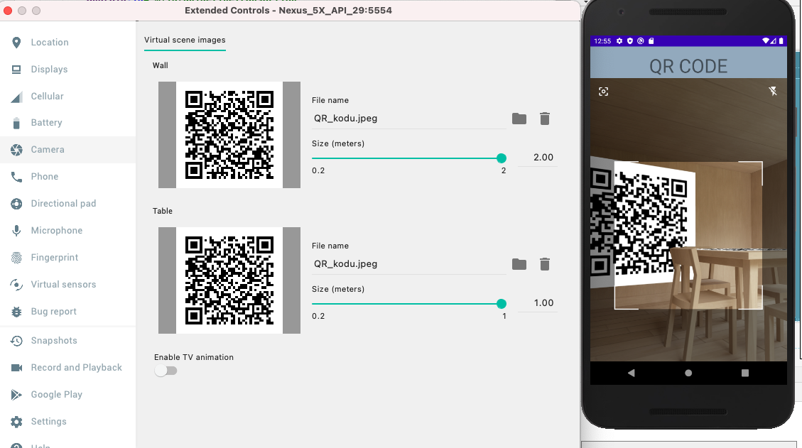
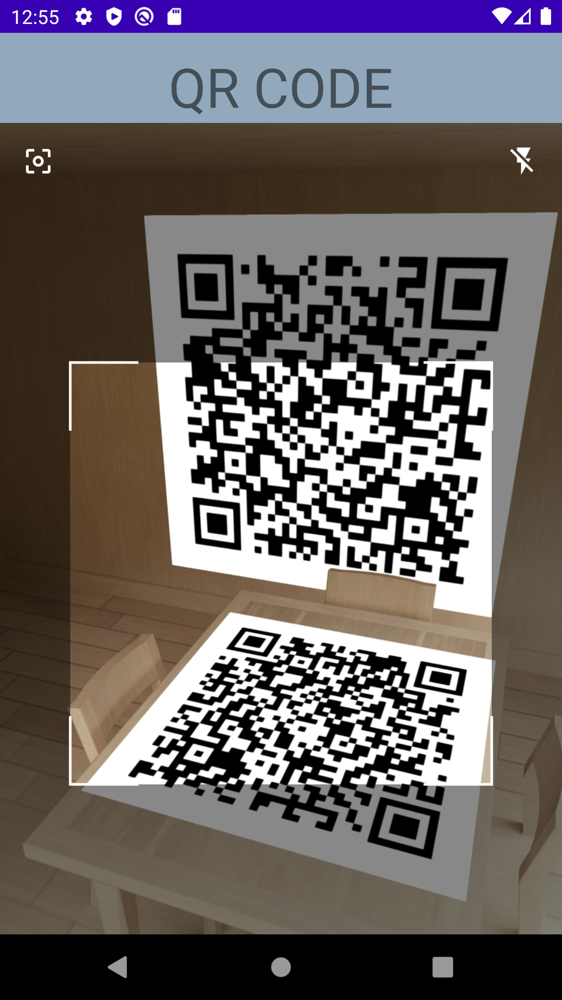

# QR-Code-Scanner

## For QR scanning, we need to give camera permission first. <dt>

 <dt>

## You can add it from the emulator qr code camera option.
 <dt>

## Result

 <dt>

# Source
https://github.com/nabinbhandari/Android-Permissions <dt>

